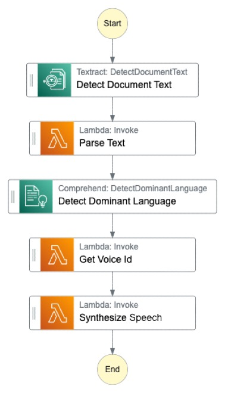

# Read4Me CDK Stack


> **This is a stable project. It should successfully build out of the box**
>
> This project is built on Construct Libraries marked "Stable" and does not have any infrastructure prerequisites to build.

---

This project creates a AWS StepFunctions Express State Machine that will read a text file and transform it to audio (text-to-speech workflow). The text file is read from a S3 Bucket (/documents folder) and the audio file is written to the same S3 Bucket (/audios folder).

## State Machine Graph



- 1 `Start`
- 2 `Detect Document Text`: Call to AWS Textract DetectDocumentText API to extract the text from the document (synchronous).
- 3 `Parse Text`: Invoke ParseText Lambda function which will transform the output from the previous step to a more suitable format -> just a string with all the text.
- 4 `Detect Dominant Language`: Call to AWS Comprehend DetectDominantLanguage API to detect the dominant language of the document.
- 5 `Get Voice Id`: Invoke GetVoiceId Lambda function which will return the ID of the voice we want to use in the next step. This is important because each voice from AWS Polly can talk in a specific language.
- 6 `Synthesize Speech`: Invoke SynthesizeSpeech Lambda function that will do two things:
  - 6.1 `Convert the text to audio`: Call to AWS Polly SynthesizeSpeech API to convert the document text to a speech. The voice of the speaker will be the previously calculated VoiceId.
  - 6.2 `Upload the audio to S3`: Upload the audio file to the S3 Bucket (/audios folder). The Lambda function will return a presigned URL that will expire after 1 hour.
- 7 `End`

## Bootstrap

If it's the first time you use CDK in your account it's probably that you need to bootstrap your environment before deploying your Stack. Just run run `npm run cdk-bootstrap <aws-profile> <account-id> <region>`. This will create the necessary resources for you to deploy your Stack.

## Install dependencies

Run `npm install` in the root of the project. Also run it in the "lambda/synthesizeSpeech" folder to install the dependencies of the Lambda function.

## Deploy

Run `npm run cdk-deploy <aws-profile> <account-id> <region>`. This will deploy / redeploy your Stack to your AWS Account.

After the deployment you will see two outputs: the State Machine ARN and the S3 Bucket name. Use this to easily find your resources.

## Destroy

Just run `npm run cdk-destroy <aws-profile> <account-id> <region>`. This will destroy your Stack.

## Synthesize Cloudformation Template

To see the Cloudformation template generated by the CDK, run cdk synth, then check the output file in the "cdk.out" directory.

## How to test that the Stack works

Just try uploading a file to your S3 Bucket /documents folder (you should create this folder first).
Then you can go to your StepFunctions state machine console and click on "Start Execution". The input will be a JSON object that requires a `bucketName` and a `objectKey` attributes, like this:

```
{
  "bucketName": "my-bucket",
  "objectKey": "documents/my-file.png"
}
```

You can see how the state machine execution is triggered and check the logs in the associated CloudWatch Log Group. After less than 1 minute the state machine will finish and the audio file will be available in your S3 Bucket /audios folder.

## Supported file types

Only PDF, PNG, JPG and JPEG documents are supported. PDFs are allowed only 1 page.
